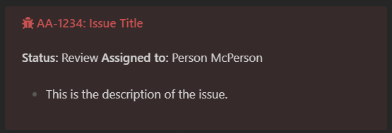

# Obsidian Jira Cloud Plugin

Connect your Jira issues to Obsidian. Issues can be added to frontmatter or accessed via the plugin API.

## Configuration

Before the plugin can be used, it must be configured.

### Generate an API key

Navigate to the [API Tokens page](https://id.atlassian.com/manage-profile/security/api-tokens) in Atlassian account settings and create a new token. Paste the value of the token into the plugin's settings in Obsidian.

### Add username and host

Add your username you use to log into Jira. This will likely be an email address. The host setting is the base URL you use to access Jira. This will likely be a URL like `https://my-company.atlassian.net`.

Once configured, the plugin should connect to Jira. If there are any issues, try restarting Obsidian first.

## Use

### Summarize to frontmatter

Executing the command `Jira Cloud: Summarize issue to frontmatter` will open a modal where you can search for issues by key or summary title. After selecting an issue, the following data will be added to the current note's YAML frontmatter:

```yaml
issues:
  - key: AA-1234
    summary: Issue Name
    link: https://your-company.atlassian.net/browse/AA-1234
    assignee: Person McPerson
    status: To-do
    reporter: Another Person
    created: 2023-07-01T13:57:38.686-0700
    updated: 2023-07-10T11:05:48.493-0700
    fullText: >-
      The full description of the issue as a single or multiline string.

      This example shows a multiline string.
```

Subsequent executions of the command will add to the issues object if a different issue is selected. If the same issue is selected, the values will be replaced.

### Add issue to frontmatter

Executing the command `Jira Cloud: Add issue to frontmatter` will open a modal where you can search for issues by key or summary title. After selected an issue, many fields will be added to the YAML frontmatter:

```yaml
issues:
  - key: AA-1234
    summary: Issue Name
    link: https://your-company.atlassian.net/browse/AA-1234
    issuetype:
      iconUrl: https://your-company.atlassian.net/rest/api/2/some_url/
      name: Bug
      subtask: false
    status:
      iconUrl: https://your-company.atlassian.net/images/icons/statuses/generic.png
      name: To-do
    assignee:
      emailAddress: person@company.com
      displayName: Person McPerson
      avatar: https://avatars.example.net/some_id/48
    reporter:
      displayName: Another Person
      avatar: https://avatars.example.net/some_id/48
    fullText: >-
      The full description of the issue as a single or multiline string.

      This example shows a multiline string.
    updated: 2023-07-10T11:05:48.493-0700
    created: 2023-07-07T13:57:38.686-0700
    priority:
      iconUrl: https://your-company.atlassian.net/images/icons/priorities/high.svg
      name: High
    project:
      name: Engineering
      key: AA
      avatar: https://your-company.atlassian.net/rest/api/3/some_url/
    labels: []
```

If the "include full API response in YAML frontmatter" setting is enabled, the data will be expanded further. Note that this will produce a very large result.

### With other plugins

This plugin exposes an API that can be used with other plugins. It can be accessed via `app.plugins.plugins['jira-cloud'].api`. See the API class [here](https://github.com/OfficerHalf/obsidian-jira-cloud/blob/main/src/api.ts).

For example, the following [Templater](https://github.com/SilentVoid13/Templater) template adds an issue inside a callout, with the callout type configured using the [Admonition](https://github.com/javalent/admonitions) plugin.

```markdown
<%\* const issue = await app.plugins.plugins['jira-cloud'].api.getIssue() %>

> [!Issue<% issue.issuetype.name %>] <% `${issue.key}: ${issue.summary}` %>
> <% `**Status:** ${issue.status.name} **Assigned to:** ${issue.assignee.displayName}` %>
>
> <% issue.fullText.split('\n').join('\n> ') %>
```

This could produce a callout like this:



## Acknowledgements

- [Atlassian](https://www.atlassian.com/)
- [Jira.js](https://github.com/MrRefactoring/jira.js)
